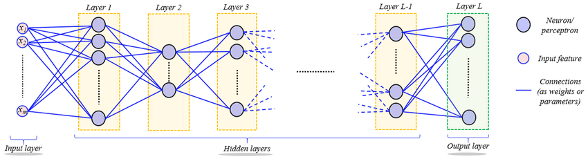
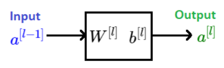
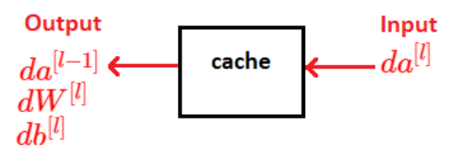

# Deep Network Architecture

## Advantage of Deep Network Architectures

The term **shallow neural network** typically refers networks with just a single hidden layer whereas the term **deep neural network** generally refers to networks with more than one hidden layer. Deep neural networks are also referred to as **deep-learning networks**.

In deep neural networks, each layer of nodes trains on a distinct set of features based on the previous layer’s output. The deeper one advances into the neural net, the more complex the features the nodes can recognize, since they aggregate and recombine features from the previous layer. In essence, shallow networks can only detect the simplest features, whereas deep networks are able to extract more complex features. This hierarchy of increasingly complex and abstract features is known as a **feature hierarchy**. It makes deep-learning networks capable of handling very large, high-dimensional data sets with billions of parameters that pass through nonlinear functions.

As a hypothetical example, a network designed to label images might have the following:

- **Layer 1** $\rightarrow$ detects edges in pictures
- **Layer 2** $\rightarrow$ groups edges together and begins to detect different parts of the image
- **Layer 3** $\rightarrow$ groups parts recognized in previous layer into even larger parts
- **Layer 4** $\rightarrow  \dots$

As another hypothetical example, a network designed to process audio files might have the following:

- **Layer 1** $\rightarrow$ detects low level wave features
- **Layer 2** $\rightarrow$ recognizes basic units of sounds (also known as "phonemes")
- **Layer 3** $\rightarrow$ groups phonemes from previous layer into words
- **Layer 4** $\rightarrow$ groups words from previous layer into sentences
- **Layer 5** $\rightarrow \dots$

## Deep $L$-Layer Network Architecture

We can generalize the mathematical notation of neural networks to a arbitrarily deep network consisting of $L$ layers.

*The diagram below depicts the generalized form of a deep neural network:*

In order to generalize the mathematical notation of neural networks to describe the architecture of a deep $L$-layer network, we must define the following:

*  $n^{[l]} \equiv \text{number of units in layer} \ l$
*  $g^{[l]} \equiv \text{activation function implemented by units in layer} \ l$

It is important to note that:
$$ \begin{align*}
    & n^{[0]} = n_x = \text{number of features in dataset} \\
    & a^{[0]} = x = \text{input feature vector}
\end{align*}$$

#### Forward Propagation

A forward pass through layer $l$ of a deep $L$-layer network is shown in the function diagram below:

The **non-vectorized** equations describing forward propogation through layer $l$ of a deep $L$-layer network are:

> **$$ \begin{align*}
>   & z^{[l]} = \bold W^{[l]} a^{[l-1]} +b^{[l]} \\
>   & a^{[l]} = g^{[l]}(z^{[l]}) \\
> \end{align*} $$**

The **vectorized** equations describing forward propogation through layer $l$ of a deep $L$-layer network are:

> **$$ \begin{align*}
>     & \bold Z^{[l]} = \bold W^{[l]} \bold A^{[l-1]} + b^{[l]} \\
>     & \bold A^{[l]} = g^{[l]}(\bold Z^{[l]}) \\
> \end{align*} $$**

The dimensions of all parameters involved in forward propogation are:

> **$$ \begin{align*}
>   \bold W^{[l]}:& \ \ (n^{[l]}, n^{[l-1]}) \\
>   b^{[l]}:& \ \ (n^{[l]}, 1) \\
>   z^{[l]}, a^{[l]}:& \ \  (n^{[l]}, 1) \\
>   \bold Z^{[l]}, \bold A^{[l]}:& \ \  (n^{[l]}, m) \\
> \end{align*} $$**

#### Backpropagation

A backward pass through layer $l$ of a deep $L$-layer network is shown in the function diagram below:

The **non-vectorized** equations describing forward propogation through layer $l$ of a deep $L$-layer network are:

> **$$ \begin{align*}
>   & z^{[l]} = \bold W^{[l]} a^{[l-1]} +b^{[l]} \\
>   & a^{[l]} = g^{[l]}(z^{[l]}) \\
> \end{align*} $$**

The **vectorized** equations describing forward propogation through layer $l$ of a deep $L$-layer network are:

> **$$ \begin{align*}
>     & \bold Z^{[l]} = \bold W^{[l]} \bold A^{[l-1]} + b^{[l]} \\
>     & \bold A^{[l]} = g^{[l]}(\bold Z^{[l]}) \\
> \end{align*} $$**

The shapes of all parameters involved in forward propogation are:

> **$$ \begin{align*}
>   \bold W^{[l]}:& \ \ (n^{[l]}, n^{[l-1]}) \\
>   b^{[l]}:& \ \ (n^{[l]}, 1) \\
>   z^{[l]}, a^{[l]}:& \ \  (n^{[l]}, 1) \\
>   \bold Z^{[l]}, \bold A^{[l]}:& \ \  (n^{[l]}, m) \\
> \end{align*} $$**

The **non-vectorized** equations describing forward propogation through layer $l$ of a deep $L$-layer network are:

> **$$ \begin{align*}
>    & dz^{[l]} = da^{[l]} * g^{\prime [l]} (z^{[l]}) \\
>    & d\bold W^{[l]} = \frac{1}{m} dz^{[l]} a^{[l-1]T} \\
>    & db^{[l]} = dz^{[l]} \\
>    & da^{[l-1]} = dz^{[l]} \bold W^{[l]T}  \\
> \end{align*} $$**

The **vectorized** equations describing forward propogation through layer $l$ of a deep $L$-layer network are:

> **$$ \begin{align*}
>    & d\bold Z^{[l]} = d\bold A^{[l]} * g^{\prime [l]} (\bold Z^{[l]}) \\
>    & d\bold W^{[l]} = \frac{1}{m} d\bold Z^{[l]} \bold A^{[l-1]T} \\
>    & db^{[l]} = \frac{1}{m} \sum_{j=1}^{m} dz^{[l]}_{ij} \\
>    & d\bold A^{[l-1]} = d\bold Z^{[l]} \bold W^{[l]T}  \\
> \end{align*} $$**

The dimensions of all parameters involved in forward propogation are:

> **$$ \begin{align*}
>   d\bold W^{[l]}:& \ \ (n^{[l]}, n^{[l-1]}) \\
>   db^{[l]}:& \ \ (n^{[l]}, 1) \\
>   dz^{[l]}, da^{[l]}:& \ \  (n^{[l]}, 1) \\
>   d\bold Z^{[l]}, d\bold A^{[l]}:& \ \  (n^{[l]}, m) \\
> \end{align*} $$**

